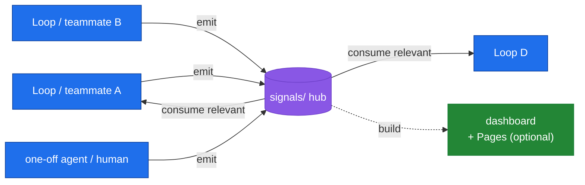

# Loobster

```
██╗                 ██████╗  ██████╗  ███████╗ ████████╗ ███████╗ ██████╗
██║                ██╔═══██╗ ██╔══██╗ ██╔════╝ ╚══██╔══╝ ██╔════╝ ██╔══██╗
██║       ██████╗  ██║   ██║ ██████╔╝ ███████╗    ██║    █████╗   ██████╔╝
██║      ██╔═══██╗ ██║   ██║ ██╔══██╗ ╚════██║    ██║    ██╔══╝   ██╔══██╗
███████╗ ╚██████╔╝ ╚██████╔╝ ██████╔╝ ███████║    ██║    ███████╗ ██║  ██║
╚══════╝  ╚═════╝   ╚═════╝  ╚═════╝  ╚══════╝    ╚═╝    ╚══════╝ ╚═╝  ╚═╝
          AI that plans, builds, verifies & secures every change — solo or team
```

[](LICENSE)


**plan → build → verify → secure · goal-loops · shared signals · configurable compliance · independent verification · local-first**

> 🦞 **Loobster** — loop + lobster. Run [`bin/loobster.sh`](bin/loobster.sh) for the animated red version of the mascot.
>
> 📖 **Docs:** [**nilswidal.github.io/loobster**](https://nilswidal.github.io/loobster/) — a team-focused docs site (source in [`docs/`](docs/), served via GitHub Pages; see [`docs/DEPLOY.md`](docs/DEPLOY.md)).

**Loobster** is a cross-tool loop harness — it runs in **Claude Code** and **Codex** (and any agent that reads `AGENTS.md` / `.agents/skills`) — that turns AI-assisted development into a **repeatable, reviewable, secure loop**. It right-sizes each task, plans before it builds, can run autonomously between approval gates, and **proves its work with an independent verifier instead of trusting itself**. It coordinates whole teams through a shared signals hub, and runs the compliance frameworks you choose against every diff.

Under the hood it follows the **RePPITS** method — Research, Propose, Plan, Implement, Test, Secure — created by [Mihail Eric](https://github.com/mihail911) ([the RePPIT framework](https://themodernsoftware.dev), from the creator of Stanford's first AI software engineering course). Healthcare (HIPAA/HITRUST) is one aspect, alongside ISO 27001 and SOC 2 — enable only what your repo needs.

## Why loop engineering

AI-assisted development is shifting from one-shot prompts to **durable, autonomous loops** — the *loop*, not the prompt, is becoming the unit of work. An agent that plans, builds, tests, and retries against a goal does far more than one that answers once. The catch: **an unsupervised loop is only as trustworthy as its guardrails.** Left alone, a loop will happily rubber-stamp its own output, drift from scope, or burn the context window.

**Loobster is the harness that makes a loop safe to let run:**
- **Risk-tiered gates** — friction scales with blast radius; sensitive changes never auto-advance.
- **Bounded convergence** — the Implement→Test→Secure fix loop caps at 3 iterations, hands the problem to a fresh resolver subagent, and only then escalates to a human (no infinite loops, no silent commits past failures).
- **Never self-verify** — every check runs in a *separate* verifier agent, so a loop can't grade its own work.
- **Signals** — independent loops (and people) coordinate through a shared, mergeable channel.
- **Compliance + token discipline** — gates run against the diff; context stays lean enough that long loops stay affordable.

It stands on two foundations: **[RePPIT](https://themodernsoftware.dev)** (Mihail Eric) gives the phase structure a loop iterates over, and **[headroom](https://github.com/headroomlabs-ai/headroom)** (Tejas Chopra) gives the token economics that make long loops viable. Loobster wires both into the agent's control loop.

## At a glance

| Capability | What it does |
|---|---|
| **Structured workflow** | Research → Propose → Plan → Implement → Test → Secure (the RePPITS method), with explicit approval gates |
| **Adaptive gating** | Phase-0 right-sizing (trivial / standard / sensitive) chooses which gates apply; sensitive never auto-advances |
| **Autonomous mode** | At Gate 3, "run autonomously" drives Implement → Test → Secure on its own (fix loop: cap 3, then a fresh resolver, then escalate; the final commit/push stops for approval — or becomes an async PR gate in a goal-loop's `pr-lane`) |
| **Goal-loop** | `/loop` interviews you once (scope, done-criteria, delivery mode), then works a RICE-scored backlog — optionally **your Linear project** (`--linear`) — cycle after cycle: crash-safe, and would-be stops climb a resolver ladder (fresh subagent → park & continue) before any human pause |
| **Live status board** | `plans/loop/status.html` — a self-contained page regenerated each cycle from the durable loop files; works across Claude Code / Codex / Cursor (`bin/loop-status.py`) |
| **External driver** | `bin/loobster-drive.sh` re-invokes any agent CLI while a loop is `active` — the durability layer for Codex/Cursor/overnight, gate-respecting |
| **Preferred subagents** | `.claude/loobster.json` routes delegation roles to models (e.g. Opus for act, a different model for verify — cross-model judging) |
| **Signals hub** | `/signals` — a shared team hub: any loop/teammate emits observations, any loop consumes them, with a dynamic dashboard |
| **Configurable compliance** | Enable any of **HIPAA · HITRUST · ISO 27001 · SOC 2** per repo — healthcare is a profile, not a requirement |
| **Token discipline** | Subagent isolation + artifact compaction always on; optional [headroom](https://github.com/headroomlabs-ai/headroom) compression |

## Install

Same repo, two runtimes — pick your agent.

### Claude Code (plugin marketplace)

In Claude Code (≥ 1.0.33):

```
/plugin marketplace add NilsWidal/loobster
/plugin install loobster@nilswidal-loobster
```

That's it. The slash commands are immediately available. To try local changes before pushing, clone first and add the path instead:

```bash
git clone https://github.com/NilsWidal/loobster.git
```
```
/plugin marketplace add ./loobster
/plugin install loobster@nilswidal-loobster
```

### Codex (and other `AGENTS.md` agents)

No install step — the methodology and skills live in the repo itself. Clone Loobster (or vendor `AGENTS.md` + `.agents/skills/` into your own project), then:

```bash
codex            # then:  $run <task>   ·   $loop <goal>   ·   $secure
```

Codex reads `AGENTS.md` from the repo root automatically and exposes each command as a skill under `.agents/skills/`. See [Use with Codex](#use-with-codex) for the details (headroom on Codex, regenerating skills after edits).

## Quick start

In any project directory:

```
/run Add a patient intake form
```

or with a Linear issue:

```
/run CAR-123
```

Loobster walks Research → Propose → Plan → Implement → Test → Secure and pauses at each gate for your approval. You can also invoke any phase directly, e.g. `/secure` to audit current uncommitted changes without running the full flow. (In Codex the same commands are `$run`, `$secure`, etc.)

## What you get

Eleven slash commands, available in Claude Code, Cursor, **Codex**, and any client that supports the Claude Code plugin spec or the `AGENTS.md` / `.agents/skills` convention (two shared reference docs — `backlog-scoring` and `token-discipline` — live in `reference/`, not as commands):

| Command | What it does |
|---|---|
| `/run <topic-or-issue>` | Run the full Research → Propose → Plan → Implement → Test → Secure workflow, with explicit approval gates between phases |
| `/loop <goal>` | Run a continuous goal-loop: work down a prioritized backlog toward a standing goal, learning each cycle (wraps `/run` as its "act" step) |
| `/signals` | Shared signals hub: any loop/teammate emits observations to a committed `signals/` store, any loop consumes the relevant ones (team coordination on one codebase) |
| `/verify-frontend` | Verifiable frontend layer: when a change touches the UI, capture Playwright screenshots and attach them to the PR (GitHub-native, no other accounts) |
| `/research-codebase` | Document the existing codebase exactly as it is today (no suggestions, no RCA) |
| `/make-proposals` | Generate up to two solution proposals grounded in research |
| `/make-plan` | Break the chosen proposal into ordered Linear issues (or local `plans/*.md` if Linear MCP is not configured) |
| `/implement <issue>` | Implement a single Linear issue (optionally inside the built-in bounded autonomous loop via `--autonomous`) |
| `/review-code` | Review all uncommitted changes, post findings to Linear |
| `/secure` | Run your enabled checklists (any of HIPAA, HITRUST, ISO 27001, SOC 2) against your diff, separating code-verifiable findings from organizational controls |
| `/resume` | Resume a paused, interrupted, or crashed workflow by reconstructing state from Claude Code Tasks |


## Adaptive, autonomous, dynamic

The workflow adapts to the task instead of forcing every change through identical friction:

- **Right-sizing (Phase 0).** `/run` classifies each task **trivial / standard / sensitive** and picks a gate policy. Trivial tasks can auto-advance the early phases with `--auto`; **sensitive tasks (PHI, auth, encryption, audit, multi-tenant, infra) never auto-advance**, and the **Secure phase always runs for every tier**. `--manual` forces every gate.
- **Autonomous convergence loop.** When Secure finds FAILs, the Implement→Test→Secure fix loop self-drives (no gate between iterations) up to a **cap of 3**; on cap-out a fresh **resolver subagent** gets 2 more independently-verified iterations with a different approach, and only then does it escalate to a human — it never silently commits past unresolved FAILs.
- **Capability tiers.** The same workflow degrades gracefully across runtimes: Tier 0 (always-on, markdown-only) → Tier 1 (parallel independent sub-issues via subagents) → Tier 2 (deterministic Workflow harness, opt-in; tracked as a follow-up).
- **Resumable.** Plan-phase work is recorded as Claude Code Tasks with a real status lifecycle, so `/resume` can rebuild and continue after a crash or a new session.
- **Self-healing, self-driving loops.** `/loobster:loop <goal>` arms its **own** durable re-entry — no wrapper needed — and survives crashes, turn boundaries, and milestone temptations via a single-runner lease, per-cycle heartbeats, and a bounded Stop-hook re-arm. An approval gate is a held breath, not an exit. The full machinery lives in [Goal-loop mode](#goal-loop-mode) below.

## Goal-loop mode

Where `/run` builds *one thing*, `/loop <goal>` pursues a *standing goal* by working down a prioritized backlog and learning each cycle. It's an **outer loop that wraps `/run`** as its "act" step:


- **Goal intake — one interview, then autonomy.** At kickoff the loop asks a *single* round of clarifying questions (scope, definition of done, constraints, and **delivery mode**) and records the answers in the marker. After that it deliberately never interviews you again — that's the point of asking once, properly. Skip with `--no-intake`.
- **Delivery mode — `pr-lane` vs `interactive`.** Grant `pr-lane` at intake and the loop commits to feature branches, pushes, and opens PRs on its own (**never the default branch**) — the commit gate becomes an async PR review instead of a blocking stop, and the loop keeps working the next item while you review. `interactive` keeps the classic stop-and-ask approval.
- **The no-stop ladder (resolve before escalate).** A would-be stop climbs: bounded act loop (cap 3) → a **fresh resolver subagent** with clean context and a different/configured model, told to try a *different approach* (cap 2, independently verified) → **park the item and continue** the backlog → human. The human rung is reached only for a **sensitive Secure FAIL that survived the resolver** (compliance is never laddered away), an all-parked backlog, or an interactive commit gate.
- **Backlog = Claude Code Tasks + metadata — or your Linear project.** Items are scored with a model-set **RICE** estimate (`(reach × impact × confidence) / effort`); the loop always works the highest-scored open item and re-scores each cycle (see `reference/backlog-scoring.md`). With **`--linear <project>`** (Linear MCP required), **Linear owns what work exists**: the backlog seeds from the project's open issues, re-syncs every cycle (externally closed/reassigned issues drop out), picked issues move to In Progress, `pr-lane` completions land as In Review with the PR linked, and newly discovered work is filed as real issues — so your team watches the loop's queue in Linear itself.
- **Goal = free text, model-judged.** The model judges met / partial / not-met against the intake's success criteria each cycle.
- **Durable by construction.** The loop arms its own re-entry (`ScheduleWakeup` + a durable cron) and **prints the schedule it armed** at kickoff; ask **`/loobster:loop status`** anytime. Every cycle heartbeats its task and checkpoints the marker, so a dead turn (API drop, crash) is reclaimed and resumed — never redone, never lost. A **single-runner lease** (an atomic lock file, `bin/loop-lease.py`, claimed with `O_CREAT|O_EXCL`, TTL sized to a full cycle) keeps one instance per worktree: a cron re-entry or parallel run **backs off instead of colliding**. The bundled Stop hook (`bin/loop-rearm.py`) refuses milestone stops **repeatedly**, bounded by a progress counter (default 5 no-progress nudges, resetting whenever the cycle advances; `LOOBSTER_LOOP_REARM=0` to disable) — while approval gates (`status: paused`) stay sacred and flip back to `active` when answered.
- **Bounded & resumable.** Cycle cap + optional token budget; a stuck item climbs the ladder and gets parked, a budget spike escalates; the backlog is durable so the loop resumes after a crash. Compliance gates and Secure are never bypassed; nothing lands on the default branch without a human.
- **Enable compression for loops.** A goal-loop re-reads code every cycle, so we **recommend turning on Option D** (`LOOBSTER_HEADROOM=1`, see Token reduction below) — the repeated code reads are exactly headroom's AST-aware `CodeCompressor` sweet spot.

## Watch it run — the status board

Every goal-loop maintains a **live, cross-tool status board**: `bin/loop-status.py build` renders `plans/loop/status.html` — a single self-contained page (no network, no deps, auto-refreshes every 30s) showing each loop's goal, status pill (active / paused / done), cycle, runner-lease freshness, backlog progress bar, delivery mode, Linear project, and last outcome. The loop regenerates it at **every cycle checkpoint**, and it's built purely from the durable marker + lock files — so it shows the same truth whether the loop is being driven by **Claude Code, Codex, Cursor, or the external driver**, and keeps working when the agent is mid-crash (a stale page is visibly stale: ages are computed client-side). Terminal version: `bin/loop-status.py`. This is deliberately **not** a chat artifact — a status page tied to one vendor's chat UI can't report on a loop running in another tool.

## Driving a loop from outside — `loobster-drive`

In-agent self-driving (`ScheduleWakeup`/cron + the Stop hook) exists only in Claude Code. For **Codex, Cursor, overnight runs, or CI**, the bundled external driver supplies the turns from outside:

```bash
bin/loobster-drive.sh plans/loop/<slug>.md --tool codex     # or claude | cursor
```

While the marker says `status: active` it re-invokes the agent CLI with the loop prompt (built from the marker's `goal:`), sleeping `--interval` between runs, capped at `--max`. A `paused` marker (human approval gate) **stops the driver without invoking** — it never supplies turns past a gate — and `done` ends it. The single-runner lease makes double-driving safe (a re-entry backs off if a live runner holds the lease). Any other CLI: `LOOBSTER_DRIVE_CMD='mytool --msg {prompt}'`. It deliberately does **not** inject permission-bypass flags — configure unattended permissions in the agent itself.

## Preferred subagents

Drop `.claude/loobster.json` (example: `reference/loobster.example.json`) to choose **which model each delegation role uses**:

```json
{ "subagents": {
    "act":      { "model": "opus"   },
    "verify":   { "model": "sonnet" },
    "research": { "model": "haiku"  },
    "resolver": { "model": "opus"   } } }
```

Every phase command reads it before spawning an `Agent`: route the expensive thinking (a strong model for **act**), keep mechanical **research** reads cheap, and — the underrated one — make **verify** a *different* model than act, so the never-self-verify rule gains capability-independence, not just context-independence (a cross-model judge doesn't share the builder's blind spots). **`resolver`** is the clean-context agent that takes over a capped-out fix loop with a different approach before any human escalation — give it your strongest model; it only runs when the act model is already stuck. No file → every subagent inherits the session model.

## Token reduction

Loobster keeps the model's working context lean in two layers:

1. **Native token discipline (always on, zero-dependency, portable).** `reference/token-discipline.md` bakes in subagent isolation (heavy reads happen in a subagent; only the conclusion returns), artifact compaction (pass summaries between phases, re-read files on demand), cache-stable prefixes, and terse output. This reduces tokens by *elimination and structure* — it works identically in Claude Code, Codex, and a custom Agent SDK harness.
2. **Wire-level output compression (Option D — on by default, two tiers).** The `PostToolUse` hook in `hooks/hooks.json` (`bin/headroom-compress.py`) shrinks large tool outputs before they enter context. It relies on the `hookSpecificOutput.updatedToolOutput` hook field, supported in **Claude Code ≥ 2.1.120** — on older versions the hook runs but Claude Code ignores its output (a silent no-op), so update Claude Code to actually get the savings:
   - **Tier 1 — [headroom](https://github.com/headroomlabs-ai/headroom), if installed.** `pip install "headroom-ai[code]"` ships the real compressors (a compiled Rust extension `headroom._core` + tiktoken); the hook prefers it when importable. headroom's mechanics are a native binary, so they **cannot be embedded** — this tier needs the install.
   - **Tier 2 — built-in lite-crush (zero-install, always on).** `bin/lite_crush.py` is a small, pure-stdlib, deterministic crusher: lossless whole-document JSON minify, marked collapse of repeated/blank lines, and clamped over-long lines. It runs whenever Tier 1 is absent, so **compression works out of the box with nothing installed**. Biggest wins on logs/JSON/repetitive output (~50–95%); near-zero (passthrough) on prose/source, where Tier 1 helps more. Lossy edits are explicitly marked with `[loobster-crush: …]` so the model never sees silent truncation.
   - **Option C — proxy / SDK middleware (any context, incl. Agent SDK).** Run `headroom proxy` and point your base URL at it, or use headroom's SDK middleware in your own harness.
   - `LOOBSTER_HEADROOM=0` disables **both** tiers; `LOOBSTER_LITE_CRUSH=0` disables only the built-in Tier 2.

> **Gratitude & attribution.** The token-reduction design here adapts the mechanisms pioneered by [**headroom** (headroomlabs-ai/headroom)](https://github.com/headroomlabs-ai/headroom) — reversible-context retrieval (CCR), prefix stabilization (CacheAligner), and content-type-aware compression of what the model reads. The native conventions and `lite_crush.py` are a runtime-free interpretation of those ideas (independent loobster code, sharing none of headroom's source); Tier 1 and Option C use headroom itself (Apache-2.0). Thank you to the headroom authors. A markdown plugin has no wire to intercept, so it cannot *be* a proxy or SDK middleware — replication is per-context (a hook covers Claude Code; middleware/proxy covers the Agent SDK), never universal.
>
> **Healthcare caveat.** Because Option D is on by default, a compressor is in the **PHI data path** whenever the hook fires: Tier 2 (lite-crush) is **first-party, local-only, no network, no disk writes**, and marks lossy edits — but it *is* a transform over tool outputs that may contain PHI. Tier 1 additionally introduces a **third party** (headroom) and PHI-at-rest via headroom's CCR store. In PHI environments, **set `LOOBSTER_HEADROOM=0`** to disable all compression until a data-path sign-off (or `LOOBSTER_LITE_CRUSH=0` to drop only the first-party tier while reviewing headroom). See `compliance/org-controls-audit.md`.

## Signals hub

A shared **central hub** for teams working on one codebase: any loop, agent, or teammate **emits** observations (frictions / opportunities / facts) into a committed `signals/` store, and any loop **consumes** the relevant ones. It's the decoupled channel that lets independent loops — and people — coordinate.



- **One signal = one file** — `signals/<date>-<author>-<slug>.md` (frontmatter + 1-line body). File-per-signal keeps multi-writer merge conflicts rare; `author` gives team attribution. See `commands/signals.md`.
- **Committed + shared** — the hub is tracked so the whole team sees it. The **load-bearing rule: signals are non-PHI summaries** ("5 users asked about export", never raw PHI) — `/secure` checks it with `bin/signals-build.py --strict`, a best-effort PHI lint that **quarantines** flagged signals from the build by default (a lint, not a guarantee).
- **Dynamic dashboard** — `bin/signals-build.py` regenerates `signals/{data.js,data.json,INDEX.md}`; open `templates/signals-dashboard.html` for a live team-status board (group by status / author / loop / type; auto-refresh).
- **Optional GitHub Pages** — `templates/signals-pages.yml` publishes the dashboard to a shared team URL, updated on each push. **Private repo / non-PHI only** (a public Pages site would expose your signals) — see `compliance/org-controls-audit.md`.
- **Signals are upstream of the backlog** — consuming a signal can spawn a RICE-scored `/loop` task.

## Use with Codex

Loobster isn't Claude-Code-only. The same workflow ships in two cross-tool formats, generated from the canonical `commands/*.md`:

- **[`AGENTS.md`](AGENTS.md)** — the methodology + non-negotiable rules, read automatically by **Codex** (and any `AGENTS.md`-aware agent) from the repo root.
- **[`.agents/skills/`](.agents/skills/)** — each command as a Codex **skill** (`<name>/SKILL.md`), invoked with `/skills` / `$run` or implicitly. (Codex deprecated custom prompts in favor of skills; these are the skills.)

```bash
# from a repo that has Loobster's AGENTS.md + .agents/skills/ present:
codex            # then:  $run <task>   ·   $loop <goal>   ·   $secure
```

**headroom on Codex:** Codex has no PostToolUse hook, so use headroom's **proxy/middleware (Option C)** — run `headroom proxy` and point Codex's model base URL at it. (The bundled Option-D hook is Claude-Code-specific.)

Regenerate the skills after editing a command: `python3 bin/build-codex-skills.py` (`--check` in CI flags drift).

## Compliance checklists — pick your frameworks

Compliance is **configurable**: enable any of four frameworks per repo. Healthcare is one aspect, not a requirement. Checklists live in `compliance/` inside the installed plugin:

- **`hipaa-checklist.md`** — Administrative, physical, and technical safeguards (§164.308-312), PHI detection, minimum necessary, BAA verification, breach notification, telehealth compliance
- **`hitrust-checklist.md`** — All 14 CSF v11 control categories (00-13): access control, risk management, encryption, operations, incident management, business continuity, privacy practices, cross-tenant isolation
- **`iso27001-checklist.md`** — ISO/IEC 27001:2022 Annex A controls relevant to a code diff: secure development (A.8.25-28), cryptography, access control, logging & masking, vulnerability & config management
- **`soc2-checklist.md`** — All Trust Service Criteria (CC1-CC9), Availability (A1), Confidentiality (C1), Processing Integrity (PI1), Privacy (P1), plus injection prevention and secrets management
- **`org-controls-audit.md`** — Schedule and tracking for organizational controls that can't be verified from code alone

Each item gets a PASS / WARN / FAIL / SKIPPED status. Items marked `[org]` (physical safeguards, board oversight, BAAs with subprocessors) are surfaced separately so they don't get auto-passed by a green diff.

### Enable / disable frameworks

Drop `.claude/loobster-frameworks.json` in your repo to choose which run:

```json
{ "frameworks": ["soc2", "iso27001"] }
```

`/secure` runs only the listed frameworks; with no file, the default is **all four**. Suggested profiles — healthcare: `["hipaa","hitrust","soc2"]` · general SaaS: `["soc2","iso27001"]`. See `compliance/frameworks.md`.

### Per-workspace overrides

To customize a checklist for a specific repo, drop a file at `.claude/compliance/<framework>-checklist.md` in that workspace. `/secure` reads workspace overrides first, then falls back to Loobster's bundled defaults.

## Linear integration (optional)

If the [Linear MCP](https://linear.app/docs/mcp) is configured in your agent (Claude Code or Codex), Loobster will:

- Read issues mentioned in `/implement <issue-id>`
- Save research and proposal documents as Linear documents
- Create parent + sub-issue structures during `/make-plan`
- Post review and security findings as comments on the relevant issue
- **Run a whole goal-loop against a Linear project** — `/loop <goal> --linear <project>` seeds the backlog from the project's open issues, re-syncs every cycle, moves issues through In Progress → In Review/Done as the loop works, and files newly discovered work as real issues (see Goal-loop mode)

If Linear is not configured, Loobster falls back to local `.md` files in `research/`, `plans/`, and the conversation transcript. Both modes work end-to-end.

## Credits

- **RePPIT methodology** — [Mihail Eric](https://github.com/mihail911), Head of AI, creator of [Stanford's first AI software engineering course](https://themodernsoftware.dev)
- **Token-reduction mechanisms** — [headroom](https://github.com/headroomlabs-ai/headroom) by [Tejas Chopra](https://github.com/chopratejas), whose CCR, CacheAligner, and content-type compressors inspired the native token-discipline conventions and power the optional Option C/D integrations
- **Loobster** — by [Nils Widal](https://github.com/NilsWidal)

## License

Apache 2.0, see [LICENSE](LICENSE).
