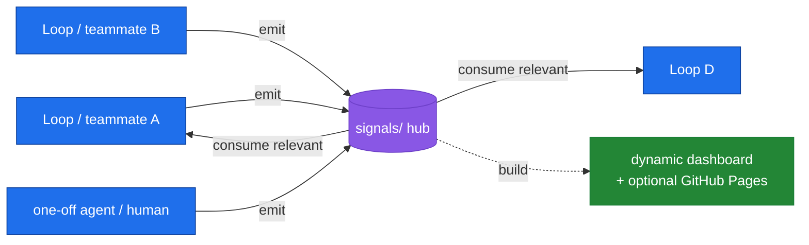

# RePPIT Health

A Claude Code plugin that runs a secure development workflow for healthcare software.

**RePPIT Health** implements the **RePPITS** methodology, **R**esearch, **P**ropose, **P**lan, **I**mplement, **T**est, **S**ecure, extending the [RePPIT framework](https://themodernsoftware.dev) by [Mihail Eric](https://github.com/mihail911) (Head of AI, creator of Stanford's first AI software engineering course) with HIPAA, SOC2, and HITRUST compliance gates for healthcare and healthtech teams.

## What you get

Ten slash commands, available in Claude Code, Cursor, and any client that supports the Claude Code plugin spec:

| Command | What it does |
|---|---|
| `/reppit <topic-or-issue>` | Run the full Research → Propose → Plan → Implement → Test → Secure workflow, with explicit approval gates between phases |
| `/reppit-loop <goal>` | Run a continuous goal-loop: work down a prioritized backlog toward a standing goal, learning each cycle (wraps `/reppit` as its "act" step) |
| `/signals` | Shared signals hub: any loop/teammate emits observations to a committed `signals/` store, any loop consumes the relevant ones (team coordination on one codebase) |
| `/research-codebase` | Document the existing codebase exactly as it is today (no suggestions, no RCA) |
| `/make-proposals` | Generate up to two solution proposals grounded in research |
| `/make-plan` | Break the chosen proposal into ordered Linear issues (or local `plans/*.md` if Linear MCP is not configured) |
| `/implement <issue>` | Implement a single Linear issue (optionally inside the built-in bounded autonomous loop via `--autonomous`) |
| `/review-code` | Review all uncommitted changes, post findings to Linear |
| `/secure` | Run HIPAA, SOC2, and HITRUST checklists against your diff, separating code-verifiable findings from organizational controls |
| `/resume-reppit` | Resume a paused, interrupted, or crashed workflow by reconstructing state from Claude Code Tasks |


## Adaptive, autonomous, dynamic

The workflow adapts to the task instead of forcing every change through identical friction:

- **Right-sizing (Phase 0).** `/reppit` classifies each task **trivial / standard / sensitive** and picks a gate policy. Trivial tasks can auto-advance the early phases with `--auto`; **sensitive tasks (PHI, auth, encryption, audit, multi-tenant, infra) never auto-advance**, and the **Secure phase always runs for every tier**. `--manual` forces every gate.
- **Autonomous convergence loop.** When Secure finds FAILs, the Implement→Test→Secure fix loop self-drives (no gate between iterations) up to a **cap of 3**, then escalates to a human — it never silently commits past unresolved FAILs.
- **Capability tiers.** The same workflow degrades gracefully across runtimes: Tier 0 (always-on, markdown-only) → Tier 1 (parallel independent sub-issues via subagents) → Tier 2 (deterministic Workflow harness, opt-in; tracked as a follow-up).
- **Resumable.** Plan-phase work is recorded as Claude Code Tasks with a real status lifecycle, so `/resume-reppit` can rebuild and continue after a crash or a new session.

## Token reduction

reppit-health keeps the model's working context lean in two layers:

1. **Native token discipline (always on, zero-dependency, portable).** `commands/token-discipline.md` bakes in subagent isolation (heavy reads happen in a subagent; only the conclusion returns), artifact compaction (pass summaries between phases, re-read files on demand), cache-stable prefixes, and terse output. This reduces tokens by *elimination and structure* — it works identically in Claude Code, the plugin, and a custom Agent SDK harness.
2. **Optional wire-level compression (opt-in).** For real, automatic, every-read compression you can layer in [**headroom**](https://github.com/chopratejas/headroom):
   - **Option D — bundled hook (Claude Code context).** Set `REPPIT_HEADROOM=1` to enable the `PostToolUse` hook in `hooks/hooks.json`, which pipes large tool outputs through a locally-installed headroom (`bin/headroom-compress.py`) before they enter context. **Default OFF**; passes through unchanged when disabled or when headroom isn't installed.
   - **Option C — proxy / SDK middleware (any context, incl. Agent SDK).** Run `headroom proxy` and point your base URL at it, or use headroom's SDK middleware in your own harness.

> **Gratitude & attribution.** The token-reduction design here adapts the mechanisms pioneered by [**headroom** (chopratejas/headroom)](https://github.com/chopratejas/headroom) — reversible-context retrieval (CCR), prefix stabilization (CacheAligner), and content-type-aware compression of what the model reads. The native conventions are a runtime-free interpretation of those ideas; Options C/D use headroom itself. Thank you to the headroom authors. A markdown plugin has no wire to intercept, so it cannot *be* a proxy or SDK middleware — replication is per-context (a hook covers Claude Code; middleware/proxy covers the Agent SDK), never universal.
>
> **Healthcare caveat.** Enabling Option D or C puts a compressor in the **PHI data path** (it reads tool outputs that may contain PHI), and headroom's CCR stores originals locally (PHI-at-rest). Both are **off by default** and require a security review / data-path sign-off before use in PHI environments — see `compliance/org-controls-audit.md`.

## Goal-loop mode

Where `/reppit` builds *one thing*, `/reppit-loop <goal>` pursues a *standing goal* by working down a prioritized backlog and learning each cycle. It's an **outer loop that wraps `/reppit`** as its "act" step:


- **Backlog = Claude Code Tasks + metadata.** Items are scored with a model-set **RICE** estimate (`(reach × impact × confidence) / effort`); the loop always works the highest-scored open item and re-scores each cycle (see `commands/backlog-scoring.md`).
- **Goal = free text, model-judged.** The model judges met / partial / not-met against your free-text success criteria each cycle.
- **Bounded & resumable.** Cycle cap + optional token budget; escalates on a stuck item, a sensitive Secure FAIL, or a budget spike; the backlog is durable so the loop resumes after a crash. Compliance gates and Secure are never bypassed; nothing auto-pushes.
- **Enable compression for loops.** A goal-loop re-reads code every cycle, so we **recommend turning on Option D** (`REPPIT_HEADROOM=1`, see Token reduction above) — the repeated code reads are exactly headroom's AST-aware `CodeCompressor` sweet spot.

## Signals hub

A shared **central hub** for teams working on one codebase: any loop, agent, or teammate **emits** observations (frictions / opportunities / facts) into a committed `signals/` store, and any loop **consumes** the relevant ones. It's the decoupled channel that lets independent loops — and people — coordinate.



- **One signal = one file** — `signals/<date>-<author>-<slug>.md` (frontmatter + 1-line body). File-per-signal keeps multi-writer merge conflicts rare; `author` gives team attribution. See `commands/signals.md`.
- **Committed + shared** — the hub is tracked so the whole team sees it. The **load-bearing rule: signals are non-PHI summaries** ("5 users asked about export", never raw PHI) — `/secure` enforces it via `bin/signals-build.py --strict`.
- **Dynamic dashboard** — `bin/signals-build.py` regenerates `signals/{data.js,data.json,INDEX.md}`; open `templates/signals-dashboard.html` for a live team-status board (group by status / author / loop / type; auto-refresh).
- **Optional GitHub Pages** — `templates/signals-pages.yml` publishes the dashboard to a shared team URL, updated on each push. **Private repo / non-PHI only** (a public Pages site would expose your signals) — see `compliance/org-controls-audit.md`.
- **Signals are upstream of the backlog** — consuming a signal can spawn a RICE-scored `/reppit-loop` task.

## Install

### From the plugin marketplace (recommended)

In Claude Code (≥ 1.0.33):

```
/plugin marketplace add carainc/reppit-health
/plugin install reppit-health@carainc-reppit-health
```

That's it. The slash commands are immediately available.

### From a local clone

```bash
git clone https://github.com/carainc/reppit-health.git
```

Then in Claude Code:

```
/plugin marketplace add ./reppit-health
/plugin install reppit-health@carainc-reppit-health
```

Useful for trying changes before pushing.

## Quick start

In any project directory:

```
/reppit Add a patient intake form
```

or with a Linear issue:

```
/reppit CAR-123
```

The plugin walks Research → Propose → Plan → Implement → Test → Secure and pauses at each gate for your approval. You can also invoke any phase directly, e.g. `/secure` to audit current uncommitted changes without running the full flow.

## Compliance checklists

Checklists live in `compliance/` inside the installed plugin:

- **`hipaa-checklist.md`** — Administrative, physical, and technical safeguards (§164.308-312), PHI detection, minimum necessary, BAA verification, breach notification, telehealth compliance
- **`soc2-checklist.md`** — All Trust Service Criteria (CC1-CC9), Availability (A1), Confidentiality (C1), Processing Integrity (PI1), Privacy (P1), plus injection prevention and secrets management
- **`hitrust-checklist.md`** — All 14 CSF v11 control categories (00-13): access control, risk management, encryption, operations, incident management, business continuity, privacy practices, cross-tenant isolation
- **`org-controls-audit.md`** — Schedule and tracking for organizational controls that can't be verified from code alone

Each item gets a PASS / WARN / FAIL / SKIPPED status. Items marked `[org]` (physical safeguards, board oversight, BAAs with subprocessors) are surfaced separately so they don't get auto-passed by a green diff.

### Per-workspace overrides

If you want to customize a checklist for a specific repo, drop a file at `.claude/compliance/<framework>-checklist.md` in that workspace. `/secure` reads workspace overrides first, then falls back to the plugin's defaults.

## Linear integration (optional)

If the [Linear MCP](https://linear.app/docs/mcp) is configured in Claude Code, the plugin will:

- Read issues mentioned in `/implement <issue-id>`
- Save research and proposal documents as Linear documents
- Create parent + sub-issue structures during `/make-plan`
- Post review and security findings as comments on the relevant issue

If Linear is not configured, the plugin falls back to local `.md` files in `research/`, `plans/`, and the conversation transcript. Both modes work end-to-end.

## Credits

- **RePPIT methodology** — [Mihail Eric](https://github.com/mihail911), Head of AI, creator of [Stanford's first AI software engineering course](https://themodernsoftware.dev)
- **Token-reduction mechanisms** — [headroom](https://github.com/chopratejas/headroom) by [Tejas Chopra](https://github.com/chopratejas), whose CCR, CacheAligner, and content-type compressors inspired the native token-discipline conventions and power the optional Option C/D integrations
- **RePPIT Health plugin** — [Cara](https://caramedical.com)

## License

Apache 2.0, see [LICENSE](LICENSE).
